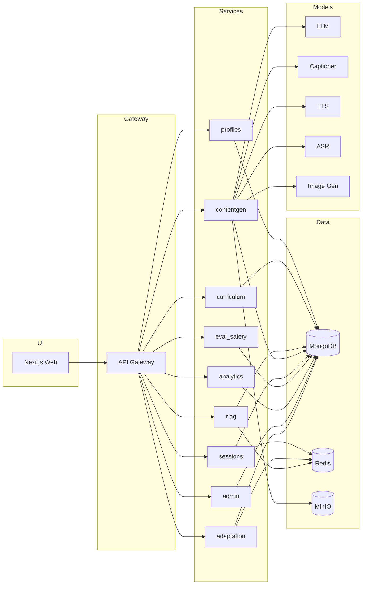

# Architecture

## Executive Summary
An adaptive multimodal learning platform leveraging MongoDB as the operational backbone, FastAPI microservices, and a Next.js frontend. Personalization uses contextual bandits (Phase 0) evolving toward reinforcement learning. Content is generated via open-source model adapters with RAG grounding.

## High-Level ASCII Diagram
```
+-------------+      +----------------+       +------------------+
|  Next.js    | <--> | API Gateway    | <-->  | FastAPI Services |
|  Web (UI)   |      | (Reverse Proxy)|       | profiles/...     |
+------+------+      +---------+------+       +---------+--------+
                             |                        |
                             |                        |
                        +----v----+       +----------v-----------+
                        | MongoDB | <---- |  RAG / Vector Search |
                        +----+----+       +----------+-----------+
                             |                        |
                   +---------v-------+       +-------v---------+
                   |  MinIO (Media)  |       | Redis (Cache)   |
                   +---------+-------+       +-----------------+
                             |
                    +--------v---------+
                    |  Model Adapters  |
                    | LLM / VLM / TTS  |
                    +------------------+
```

## Mermaid (Component)


## Key Data Flows
1. Generation: UI -> Gateway -> contentgen -> RAG -> LLM -> evaluations -> store bundle.
2. Adaptation: sessions events -> adaptation bandit -> recommend-next SSE -> UI.
3. Safety: contentgen triggers eval_safety; blocking issues returned to educator queue.

## Scaling & Observability
- Horizontal scale per service; GPU nodes for model adapters.
- Request correlation: `X-Request-ID` header (or generated) propagated via middleware across services and surfaced in logs & health endpoints.
- Caching: Optional Redis for content bundle cache (hash keyed) and adaptation recommendation debounce (short TTL) to reduce duplicate generation and burst load.
- Rate limiting: Lightweight in-memory per-service (POST/PUT/PATCH) with `X-RateLimit-Remaining` header and configurable per-minute quotas.
- Metrics: Prometheus counters/histograms (request latency & count, adaptation feedback, bundles generated/cached, sessions/events). Future: histogram buckets for content token sizes, eval failures.
- OpenTelemetry (optional) guarded by env; falls back gracefully if exporter packages absent.
- Planned: Structured trace propagation into model adapter calls & RAG queries (Phase 1).

## MongoDB Usage
- Hybrid search via Atlas Vector Search + Atlas Search for text.
- Collections indexed per spec with JSON Schema validation (see seeds script).

(Additional sections TBD in later phases)
